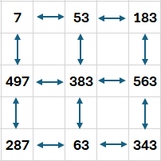

# Grafos

Este exercício de Grafos em linguagem C pretende calcular a soma máxima de uma matriz de números inteiros.
Como a soma máxima é calculada sabendo que apenas podemos usar uma linha uma vez e também uma coluna apenas uma vez, foi assumido que para poder efetuar o cálculo, a matriz teria de ser quadrada.
No entanto, antes de calcular a soma máxima, o utilizador pode adicionar e remover linhas e colunas permitindo assim temporariamente que a matriz não seja quadrada.
O utilizador também pode alterar os valores da matriz para além de poder também carregar um ficheiro de texto contendo os valores da matriz separados por um caractere arbitrário.

O trabalho desenvolvido está separado em 3 grupos:
1. CalcMatriz.c
2. Grafos.c e Grafos.h
3. utils.c e utils.h

## 1. CalcMatriz
CalcMatriz é o ficheiro principal e ponto de entrada na aplicação. E portanto onde se encontra a função "main" cuja finalidade é apresentar o menu e fazer um ciclo para que o utilizador possa escolher entre as diversas opções até escolher a opção 9 que é sair da aplicação. Este ficheiro contém as seguintes funções:
* DisplayMenu - função que mostra o menu principal
* ListagemTabela - função chamada pelo menu para listar a matriz. Para isso determina quantos caracteres são necessários para cada elemento para mostrar todos com o mesmo tamanho. Também tem parâmetros para listar o número da coluna ou o número da linha, para o utilizador poder identificar a linha ou coluna nas escolhas. 
* CarregarFicheiro - função chamada pelo menu que pede ao utilizador qual o nome do ficheiro (pode incluir um caminho) e qual o separador a usar. Depois limpa a matriz e obtém as linhas do ficheiro. Depois divide as linhas em valores e insere o valor na nova matriz. Cada linha do ficheiro é uma linha da matriz.
* InserirValores - função chamada pelo menu para alterar um valor da matriz. Pede ao utilizador qual a linha/coluna e também qual o valor a colocar e depois troca o valor.
* InserirLinha - função chamada pelo menu para inserir uma linha vazia na posição que o utilizador escolher. Os valores inseridos vão ser todos zero.
* InserirColuna - função chamada pelo menu para inserir uma coluna vazia na posição que o utilizador escolher. Os valores inseridos vão ser todos zero.
* RemocaoLinha - função chamada pelo menu para remover uma linha. Pede ao utilizador qual o número da linha a remover.
* RemocaoColuna - função chamada pelo menu para remover uma coluna. Pede ao utilizador qual o número da coluna a remover.
* CalculaSoma - função chamada pelo menu. Faz a verificação de ser matriz quadrada, chama função que calcula e mostra o resultado.
* CalculaMaxSoma - função com o algoritmo principal do cálculo da soma máxima.

### 1.1 Carregar a partir de ficheiro de texto
Esta opção permite carregar a matriz a partir de um ficheiro. Para isso pede ao utilizador o nome do ficheiro (que pode incluir um caminho). Caso não consiga ler o ficheiro, apresenta uma mensagem de erro.
Depois pergunta qual o caractere para usar como separador. Nos exemplos dados é a vírgula ",".
Existem 3 ficheiros de exemplo:
* Matriz3x3.txt com 3 linhas e um total de 9 elementos
* Matriz5x5.txt com 5 linhas e um total de 25 elementos
* Matriz10x10.txt com 10 linhas e um total de 100 elementos

### 1.2 Alteração de valores
Esta opção permite alterar um valor da matriz. Para isso, mostra a matriz com numerador de linhas e pergunta ao utilizador qual a linha do valor que quer alterar. Depois mostra a matriz com numerador de colunas e pergunta qual a coluna do valor que quer alterar. Finalmente, pergunta qual o novo valor a colocar.

### 1.3 Inserção de nova linha
Esta opção permite inserir uma nova linha antes da linha escolhida. Para isso mostra a matriz com numerador de linhas e pergunta qual a posição para a nova linha. As linhas seguintes deslocar-se-ão para baixo. Os valores inseridos na nova linha são todos colocados a zero e será preciso alterar posteriormente com a opção de alterar valores.

### 1.4 Inserção de nova coluna
Esta opção permite inserir uma nova coluna antes da coluna escolhida. Para isso mostra a matriz com numerador de colunas e pergunta qual a posição para a nova coluna. As colunas seguintes deslocar-se-ão para a direita. Os valores inseridos na nova coluna são todos colocados a zero e será preciso alterar posteriormente com a opção de alterar valores.

### 1.5 Remoção de linha
Esta opção permite remover uma linha escolhida. Para isso mostra a matriz com numerador de linhas e pergunta qual a posição da linha a remover. As linhas seguintes deslocar-se-ão para cima. 

### 1.6 Remoção de coluna
Esta opção permite remover uma coluna escolhida. Para isso mostra a matriz com numerador de colunas e pergunta qual a posição da coluna a remover. As colunas seguintes deslocar-se-ão para a esquerda.

### 1.7 Listagem da Tabela
Esta opção permite mostrar a matriz de forma tabelar. Para o poder fazer, é preciso primeiro calcular quantos dígitos ocupa o maior número existente na matriz. Isso é necessário para que a matriz apareça corretamente formatada.

### 1.8 Cálculo da soma máxima
Esta opção permite calcular a soma máxima da matriz. Para isso a matriz tem de ser quadrada e portanto faz essa verificação no início. Depois de obter a lista dos valores da soma máxima, apresenta os valores e também a soma final.
O algorítmo para calcular a soma máxima segue o seguinte:
* Se matriz só tem 1 elemento, devolve esse elemento numa nova lista.
* Percorer os primeiros elementos das linhas da matriz e encontrar a soma máxima da matriz restante que não contém esse elemento. Isto é, se a matriz é 3x3 será calculado a matriz restante com 2x2 elementos, retirando a coluna e a linha do elemento atual. Para calcular a soma máxima da matriz restante, é chamada a própria função recursivamente.
* Ao resultado da soma da matriz restante, adicionar o elemento atual.
* Se a soma der superior à soma anterior, troca o resultado pelo resultado actual.
Como o algorítmo percorre as linhas todas e da primeira coluna será preciso escolher um elemento, o resultado final é aquele cuja soma dá maior valor.

## 2. Grafos
É o ficheiro com as funções necessárias para manipular a matriz. Tem o "Grafos.c" com a implementação e "Grafos.h" com as definições. 

### 2.1 Definição dos vértices, dos arcos e dos dados
Os elementos da matriz são definidos da seguinte forma:
* vertice
	* dados - é um apontador para estrutura "dados_vertice"
	* proximo - é um apontador para o próximo vértice na lista
	* arcos - é um apontador para a estrutura "arco"
* arco
	* destino - é um apontador para estrutura vertice que é o vértice para onde o arco aponta
	* proximo - é um apontador para o próximo arco na lista
* dados_vertice
	* valor - é o valor na posição na matriz
	* linha - é o número da linha na matriz (começa em zero)
	* coluna - é o número da coluna na matriz (começa em zero)

Na figura acima está representado um exemplo de uma matriz 3x3 onde podemos ver a azul as setas representativas dos arcos que ligam cada elemento aos adjacentes.
Não está representada a lista de ligações para o proximo vértice porque a qualquer momento isso pode mudar. Ou seja, a matriz é uma lista desordenada de elementos, cada um com arcos a apontar para os vértices vizinhos mas não segue nenhuma ordem específica. O que torna possível saber onde está colocado cada elemento, é o seu número de linha/coluna.

### 2.2 Funções implementadas
A seguir a explicação do propósito de cada função implementada em Grafos.c:
* listagemSimples - função auxiliar implementada apenas para poder verificar o estado da matriz, os vertices e a posição deles. Usada maioritariamente para Debug.
* adjacente - função auxiliar para determinar se um vértice é adjacente a outro. Criada inicialmente para experimentar as funções sobre grafos apenas.
* juntar - função auxiliar para juntar dados de dois vértices. Criada inicialmente para experimentar as funções sobre grafos e deixou de ser necessária, sendo substituída pela função juntarVertices.
* juntarVertices - função para juntar dois vértices, cria 2 arcos ligar bidirecionalmente caso ainda não exista essa ligação.
* separar - função para separar dois vértices, mas apenas a ligação v1 a v2.
* removeLigacoes - função para separar dois vértices de forma bidirecional.
* limpaMemoria - função que limpa da memória toda uma lista de vértices.
* criaVertice - função que cria um vértice com os dados passados, lista de arcos vazia e próximo elemento vazio.
* verticePorPosicao - função que percorre a lista de vértices e encontra o elemento na linha/coluna indicada. Esta função é útil quando não está garantida a ligação entre vértices.
* insereMatriz - função que cria novo vértice e tenta ligá-lo a todos os vértices adjacentes baseado na linha/coluna.
* obtemMaiorValor - função que percorre uma lista de vértices e determina qual o maior valor que lá se encontra.
* verticeDaDireita - função que dado um vértice, obtem o vértice que tem um coluna maior do que a do vértice dado baseado na lista de arcos do vértice passado.
* verticeDaEsquerda - função que dado um vértice, obtem o vértice que tem um coluna menor do que a do vértice dado baseado na lista de arcos do vértice passado.
* verticeDeCima - função que dado um vértice, obtem o vértice que tem uma linha menor do que a do vértice dado baseado na lista de arcos do vértice passado.
* verticeDeBaixo - função que dado um vértice, obtem o vértice que tem uma linha maior do que a do vértice dado baseado na lista de arcos do vértice passado.
* procuraElementoNaPosicao - função que encontra um vértice na linha/coluna dada baseando-se nos arcos dos vértices, isto é, percorre a matriz usando as linhas e colunas em vez de percorrer sempre a lista.
* alterarValorVertice - função que encontra um vértice baseado na linha/coluna dada e muda o valor desse vértice.
* insereLinhaMatriz - função que cria uma linha inteira de vértices numa matriz, no número da linha passada. Também é preciso passar o numero de colunas porque é preciso saber quantos vértices é preciso criar.
* insereColunaMatriz - função que cria uma coluna inteira de vértices numa matriz, no número de coluna passada. Também é preciso passar o número de linhas porque é preciso saber quantos vértices é preciso criar.
* removeColunaMatriz - função que remove todos os elementos na coluna indicada. Para isso refaz as ligações dos elementos da esquerda com os elementos da direita.
* removeLinhaMatriz - função que remove todos os elementos na linha indicada. Para isso refaz as ligações dos elementos de cima com os de baixo.
* imprimeLista - função auxiliar para imprimir os elementos de uma lista de vértices, baseado nos próximos elementos e não na suas posições na matriz.
* somaElementos - função que devolve a soma de todos os elementos (valor) de uma lista de vértices.
* contaElementos - função que devolve quantos elementos tem uma lista de vértices.
* matrizRestante - função que devolve uma nova matriz, mais pequena, baseada noutra matriz, maior, e de onde foram retirados todos os elementos numa determinada linha ou coluna.

## 3 - utils
Foi criado o módulo "utils" para agrupar funções que apesar de nada terem a ver com grafos ou matrizes são úteis para facilitar a execução:
* ClearConsole - função para limpar o ecrã todo.
* GetMenuOption - função que pede ao utilizador qual a opção que escolhe.
* ClearInputBuffer - função que limpa o buffer de teclas
* InputAnyText - função que faz o programa aguardar até que o utilizador faça ENTER
* countDigits - função que conta quantos dígitos tem o número passado por parâmetro.
* split_string - função que divide uma string separando por um determinado caratere separador.

